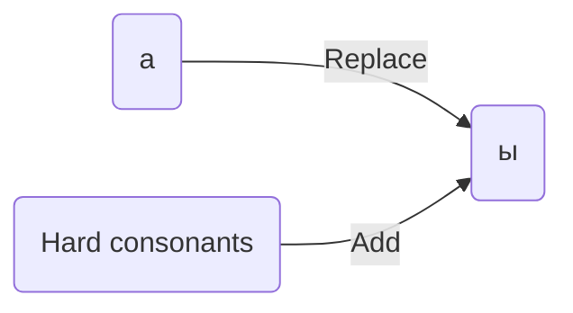
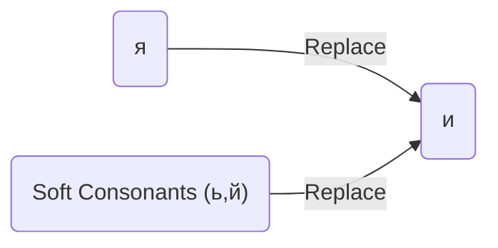
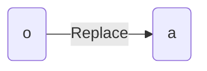
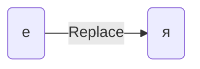

---
tags:
  - russian
---
>[!SUMMARY]- Table of Contents
>   - [[Plurals#First Version|First Version]]
>   - [[Plurals#Second Version|Second Version]]
>   - [[Plurals#Third version|Third version]]
>   - [[Plurals#Fourth version|Fourth version]]

>[!important]- Exceptions
>``` mermaid
>flowchart LR
>1("`г к ж
>х ш
>ч щ`") --> и
>```
>**Ex**
>```mermaid
>flowchart LR
>1("`пир**о**г`") -- Add --> 2("`пирог*и*`")
>3("`кн**и**га`") -- Replace --> 4("`кн**и**г*и*`")
>
>```
>**Super Important**
>
>```mermaid
>flowchart LR
>1("`бр**а**т`") --> 2("`бр**а**тья (brothers)`")
>3("`сестр**а**`") --> 4("`с**ё**стры (sisters)`")
>5("`др**у**г`") --> 6("`дгузь**я** (friends)`")
>7("`д**о**м`") --> 8("`дом**а** (houses)`")
>```

---
## First Version


>[!info]- **Ex**
>```mermaid
>flowchart LR
>1("`к**о**мната
>(room)`") -- Replace --> 2("`к**о**мнат*ы*`")
>3("`студ**е**нт`") -- Add --> 4("`студ**е**нт*ы*`")
>5("`бл**и**н
>(Pancake)`") -- Add --> 6("`блин*ы*`")
>```

## Second Version


>[!info]- **Ex**
>```mermaid
>flowchart LR
>1("`дядя
>(uncle)`") --> 2("`дад*и*`")
>3("`семь**я**
>(family)`") --> 4("`с**е**мь*и*`")
>5("`б**о**й
>(battle)`") --> 6("`бо**и**`")
>7("`кров**а**ть
>(bed)`") --> 8("`кров**а**т*и*`")
>9("`дверь
>(door)`") --> 10("`двер*и*`")
>```

## Third version



>[!info]- **Ex**
>```mermaid
>flowchart LR
>1("`окн**о** (window)`") --> 2("`**о**кн*а*`")
>3("`пиво (beer)`") --> 4("`пив*а*`")
>```

## Fourth version


>[!info]- **Ex**
>```mermaid
>flowchart LR
>1("`мор**е** (sea)`") --> 2("`мор*я*`")
>3("`зд**а**ние 
>(building, house, 
>construction)`") --> 4("`зд**а**ни*я*`")
>```

