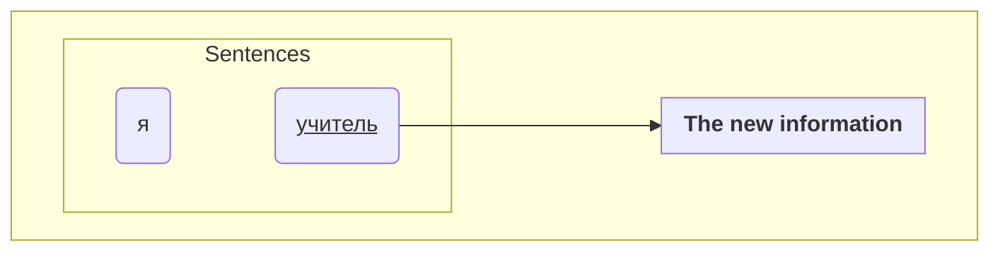
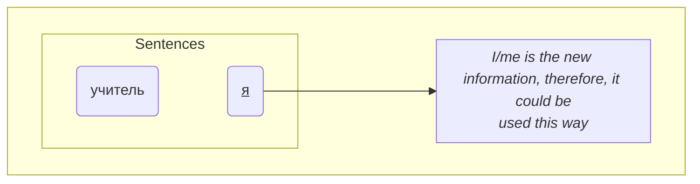

---
tags:
  - russian
---

>[!SUMMARY]- Table of Contents
>   - [[Structure#Word Order|Word Order]]
## Word Order
**Ex**
моя <u>профессия</u> - учитель

>[!important] 
>places of the words depends on the what's being emphasized at the moment of speaking, in this case it's the **professions**

<u>учитель</u> - профессия моя

- in this case it was the **teacher** part that's being emphasized ==It's flexible but it's not random==

In general the sentences follows the english rules of structure.

| Structure | Predicate | Object  |
| :-------: | :-------: | :-----: |
|     я     | чита**ю** | книг*у* |

**New Information** typically goes to the <u>end</u>
of the sentences.

**Ex**
кто учитель? *where's the teacher?*

